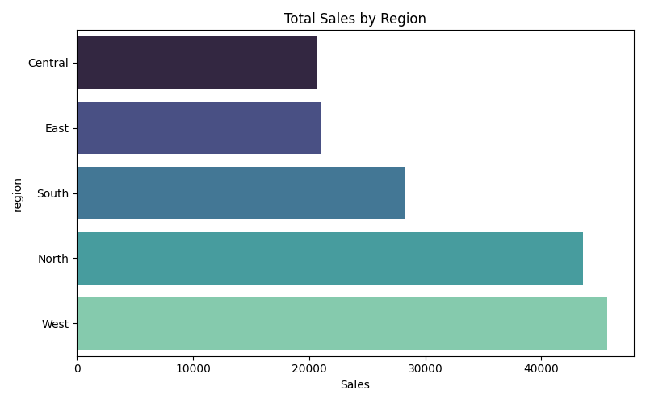

# 💼 Legacy Sales Refresher ETL Pipeline

A fully modular ETL pipeline built to ingest, clean, and analyze legacy sales data using Python and MySQL. This project demonstrates real-world data engineering practices from raw ingestion to visualization-ready analytics.

## ⚙️ Tech Stack

- **Python 3.11**
- **Pandas** for data wrangling
- **MySQL** for structured storage
- **Matplotlib & Seaborn** for visual reporting
- **Modular folder structure** with clear ETL separation

## 🔄 Workflow Overview

1. **Extract** — Load a legacy-format CSV file  
2. **Transform** — Clean currency, parse human-readable dates, remove bad data  
3. **Load** — Insert clean rows into a MySQL table  
4. **Report** — Generate region-wise and time-series visual charts

## 📊 Sample Visualizations

  
*A breakdown of total sales grouped by region.*

  
*Time-series visualization of monthly sales performance.*
